# UoN Video Helper — UX review, 1 October 2026

Backlog item VH-104. One first-time member of staff's walk through the whole
page, Choose to Save, in Chrome at desktop and phone width, judged against
Carbon's productive patterns, [`UI-STANDARDS.md`](../../UI-STANDARDS.md),
WCAG 2.2 AAA and spec §9.2.

**Verdict.** The bones are sound: one path, safe defaults, plain sentences in
most places, a keyboard order that follows the steps, visible focus on every
control, and — for a file that cannot be read — an error that says exactly what
happened and what to do. What does not hold is _time_. The page is right about
the moment it was drawn and wrong about the moments after: a verdict outlives
its trim, a question outlives the choice it asked about, a finished video
outlives its file, and focus is dropped whenever the control it sits on goes
away. And the most ordinary input of all, a 29-minute Teams recording, does
three minutes of work and then fails at the last step.

25 findings: 3 at rank 1, 15 at rank 2, 7 at rank 3. Each is a backlog item
(VH-106 to VH-114) or is set aside below with a reason.

| Baseline | |
| --- | --- |
| Commit | `46f5b42`, branch `codex/repository-review-remediation` |
| Walkthrough | Claude, in Chrome 154 driven headlessly over the DevTools protocol; the dev build, with its dev-only buttons hidden as production hides them |
| Source review | Codex astra (`gpt-6-astra`), read-only and independent; kept as [codex-astra-source-review-2026-10-01.md](codex-astra-source-review-2026-10-01.md) |

## How it was done

- **Viewports.** Desktop at 1280 × 900. Phone at 390 × 844 with a mobile user
  agent (`navigator.userAgentData.mobile` true), touch and a coarse pointer.
  Also: reflow at 320 px, WCAG 1.4.12 text spacing, dark mode, and emulated
  forced colours.
- **As a person would.** Files were chosen through the real file input
  (`DOM.setFileInputFiles`) and dropped as a real operating-system drag
  (`Input.dispatchDragEvent`); keys were real key events. Only the system's own
  save dialog was stood in for, by a `showSaveFilePicker` stub writing into
  OPFS, so the page's save path ran unchanged.
- **Material.** The 29-minute Teams recording in `samples/` (1920 × 1080,
  16 fps, mono, 212 MB) — the persona's input; two short slide lectures,
  AMCS3059 (130 s) and MLAC3139 (83 s); a ProRes 4K closing master, which Chrome
  cannot decode; an iPhone HDR clip; and three ffmpeg fixtures — a video with a
  caption track, a silent video, and a text file named `.mp4`.
- **Two reviewers.** Codex astra read every state the page can show, from
  source, while the walk ran: sixteen findings, a copy audit and a view on
  VH-97. Each of its findings was then checked — reproduced live where the
  browser could reach it, re-read in source where it could not — and each
  finding below says which.
- **Evidence.** Screenshots are in [`evidence/`](evidence/), cropped so that no
  frame of a real recording and no real file name appears: the samples are real
  lectures and stay out of the repository.

**Ranks.** **1** — a novice is blocked, misled, or could lose work or trust.
**2** — real friction, or a breach of a named standard. **3** — polish.

## Findings

### U-01 A real Teams recording fails at the last step — rank 1

**Saw.** The 29-minute Teams recording with every default: "Ready to go — This
should take about 5 minutes 20 seconds." Create; "Analysing audio — 0%",
"Encoding video", "Finishing the file — 100%"; then, about three minutes in,
"The video could not be created." The development build appends the cause:
`Output audio failed verification: loudness-out-of-range`. A second,
independent run through `/spike-real.html` failed the same way: delivered
**−16.857 LUFS** against −16 ±0.5, true peak −2.92 dBTP (passes). The source
measures −21.27 LUFS and −1.90 dBTP, with a loudness range of about 21.9 LU and
one silent stretch of 8 min 58 s.

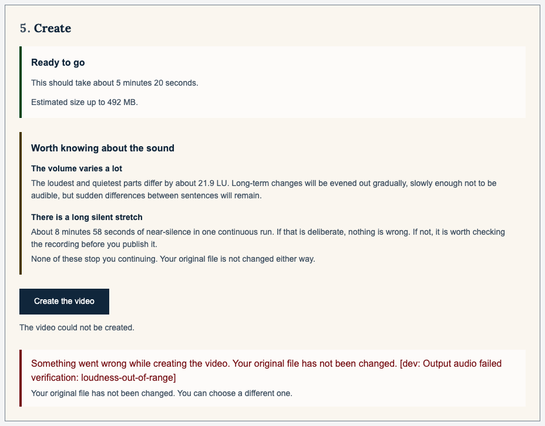

**Standard.** Spec §13 criterion 2 (the output invariant) and §9.2.

**Experience.** Teams recordings are the first source the brief names. This one
is refused after the work is done, and the page then offers the same "Create
the video" button, which will spend another three minutes failing the same way.

**Direction.** The verification is right to refuse: an off-target file must not
be called a success. The defect is upstream — the gain solve aims, and on this
recording the delivered file lands 0.86 LU under it, the gap VH-83's codec-probe
correction exists to close. Make this recording land in tolerance and pin it as
a regression case; meanwhile, a failure here should not invite an identical
retry (U-06).

**Source.** `src/media/output-verification.ts:56-57`;
`src/workers/job.worker.ts:258-273`. **From:** walkthrough. **Item:** VH-106.

### U-02 "Discard it and start again" outlives the question — rank 1

**Saw.** With an unsaved video on the page, Create asks "You have not saved the
video you just made. Starting again will discard it." with "Discard it and
start again" and "Keep it". The question stays on screen while the trim is
changed. With the trim then in error — "Keep at least 3 seconds of the video."
and the status "Put the start and end times right in step 2 to continue." —
Discard still worked. It threw away the unsaved video and started a job with
**no range**, the whole recording whatever the trim says (the request reached
the worker with no `keptRange` at all), and that job ran
with **no Cancel button on screen**, because the trim error had hidden the row
Cancel lives in. With a valid new trim, Discard sent the new range — but only
because the re-check had landed first; pressed while it is pending, it sends
none.

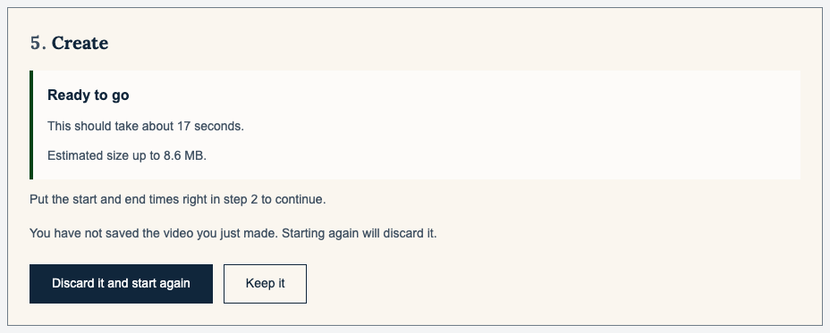

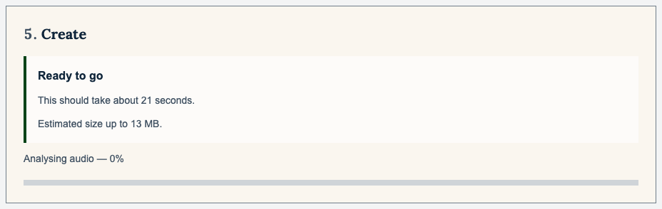

**Standard.** Spec §9.2 ("Cancel is always available"); UI-STANDARDS → Error
prevention ("disable impossible actions"), User control and freedom.

**Experience.** One press destroys the only copy of the last video, starts one
that does not match the screen, and leaves no way to stop it.

**Direction.** Any change to the selection retires the question and restores
the result it interrupted; Discard passes the same gate Create does.

**Source.** `src/main.ts:1305-1338` (`confirmDiscardThenStart`), `:957-968`
(a trim change clears `jobKeptRange`), `:1355`, `:1366` (`beginJob` reads it).
**From:** Codex F01, reproduced live and extended (the missing Cancel).
**Item:** VH-107.

### U-03 The previous video's Save sits under the next video — rank 1

**Saw.** Finish AMCS3059 without saving, then choose MLAC3139. The Create step
reads "Ready to go — This should take about 22 seconds. Estimated size up to
13 MB." for the new file and, directly beneath, "Finished video — 7.2 MB." with
a solid "Save the video". Nothing says that video is AMCS3059's.

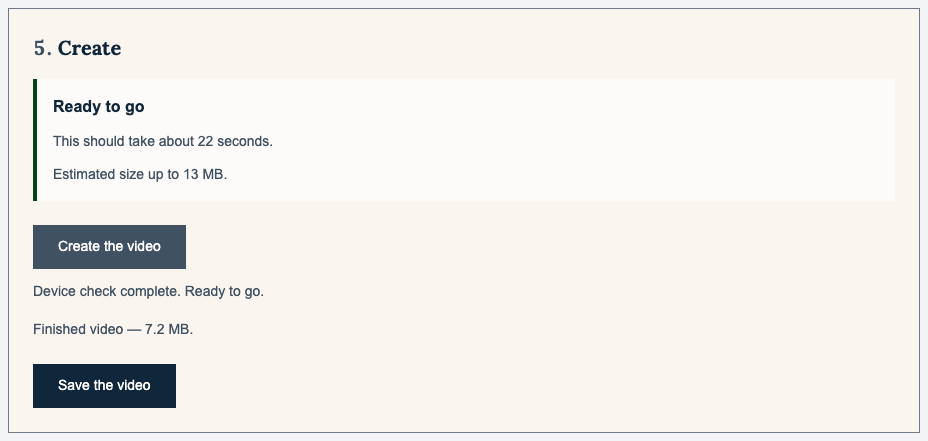

**Standard.** UI-STANDARDS → Recognition over recall, Consistency.

**Experience.** Someone making several videos in a row saves, and may publish,
the wrong lecture; only the suggested name in the system's save dialog gives it
away.

**Direction.** The kept result names its file and says it is the previous
video, in the same block.

**Source.** `src/main.ts:656-660`, `:1505`. **From:** Codex F02, reproduced
live. **Item:** VH-107.

### U-04 "Ready to go" outlives the facts — rank 2

**Saw.** (a) With the trim in error, the green "Ready to go" box stands above
"Put the start and end times right in step 2 to continue." — and there is no
Create button. (b) After the job, and after "Saved.", it still reads "Ready to
go — This should take about 37 seconds." (c) After U-01's failure it still heads
the step, above "The video could not be created." In source, a changed preset
or trim leaves the previous check's sound notes on screen in the same way.

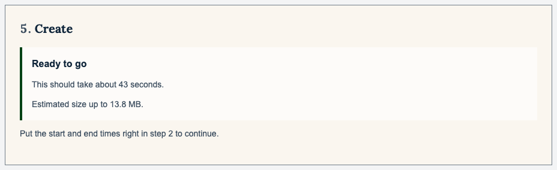

**Standard.** UI-STANDARDS → System status, Recognition over recall ("show
current selection, mode and state explicitly").

**Experience.** Two messages a few lines apart contradict each other, and the
green one is the louder.

**Direction.** A verdict that no longer describes the current selection is
withdrawn, or visibly marked out of date, together with its sound notes, until
the re-check lands; after a job, the step leads with the job's outcome.

**Source.** `src/main.ts:723-726` (returns with the old verdict on screen),
`:811-817`, `:957-968`. **From:** both — Codex F09 found (a); the walk found
(b) and (c). **Item:** VH-108.

### U-05 A file Chrome cannot decode is read, offered every step, then refused at the bottom — rank 2

**Saw.** A ProRes 4K master, as an editing suite produces. Step 1 says "Video
read. 5 seconds, 3840 × 2160, no sound."; steps 2–4 open and work, Trim saying
"A preview is not available for this file. You can still set the times."; only
step 5, some 1,200 px further down, says "This cannot run here — This browser
cannot read the picture or sound inside this file. Chrome on a computer will
open more formats…" — to someone already in Chrome on a computer. Beneath the
refusal, the sound note ends "None of these stop you continuing."

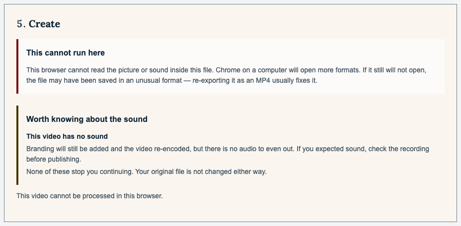

**Standard.** Spec §9.2 (what to do next); UI-STANDARDS → Error prevention
("validate early, disable impossible actions"), Consistency.

**Experience.** The user can spend time trimming and choosing branding for a
file that cannot be made, is then told to move to the browser they are using,
and is told underneath that nothing stops them.

**Direction.** When pre-flight blocks, say so at step 1 beside the file and do
not offer steps 2–4 as if they lead somewhere; give the remedy that fits
(re-export as MP4) when the user is already in desktop Chrome; drop "None of
these stop you continuing" under a block.

**Source.** `src/main.ts:674` (the steps are revealed on read, before the
verdict); `src/ui/preflight-panel.ts:39`; `src/ui/warning-text.ts:129`.
**From:** walkthrough. **Item:** VH-108.

### U-06 Failures give the wrong next step — rank 2

**Saw.** U-01's failure reads "Something went wrong while creating the video.
Your original file has not been changed." and then "Your original file has not
been changed. You can choose a different one." — the reassurance twice, no
cause, and advice to replace a recording that is not the problem. The Errors
captured panel (raised with the dev-only test button) shows "error on the
worker thread — Uncaught Error: …" over a stack trace. In source, a start-up
failure says "This browser is missing something the tool needs. The system
check below says what." — pointing at rows named "WebCodecs video encoding" and
"Secure context (needed for storage access)" — while the file input stays
usable.

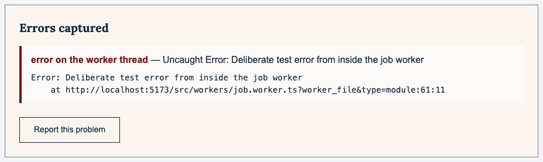

**Standard.** Spec §9.2 ("every error states what happened, whether the
original file is affected, and what to do next"); UI-STANDARDS → "No vague
'Something went wrong' without actionable detail", user language.

**Experience.** At the worst moment the page is least helpful: vague,
repetitive, technical, or wrong about what to do.

**Direction.** One message per known kind of failure, each with the next step
that fits it — try again, try the other output, re-export, report it; the stack
behind a disclosure, after a plain sentence; a start-up failure said at Choose,
in words, naming Chrome only where the browser is the cause.

**Source.** `src/workers/job.worker.ts:326`, `:561`;
`src/ui/source-panel.ts:292`; `src/main.ts:394`, `:410-411`, `:577`, `:584`.
**From:** both — Codex F06, F07 and F08; the job failure and the panel seen
live. **Item:** VH-110.

### U-07 Progress sits at 0%, then says 100% too soon — rank 2

**Saw.** On the Teams recording, "Analysing audio — 0%" with an empty bar for
13 seconds, then "Encoding video — 1%"; at the end "Finishing the file — 100%",
after which the job still checked the picture, re-measured the whole file, and
failed (U-01). The analysing stage reports 0 for its whole length, so the longer
the recording, the longer the page looks stuck.

**Standard.** UI-STANDARDS → System status ("the UI must never appear frozen");
Carbon's progress bar, indeterminate where progress cannot be measured; spec
§9.2 (named stages).

**Experience.** A long recording looks hung before it starts, and "100%" is
followed by a failure.

**Direction.** No percentage where none is measured — an indeterminate bar with
the stage named; the final check as a named stage of its own; 100% only when
the video is ready.

**Source.** `src/media/pipeline.ts:306`, `:317`; `src/workers/job.worker.ts:244`
(finishing at 1, before the checks at `:247-273`). **From:** both — Codex F10,
seen live. **Item:** VH-109.

### U-08 Every percent is announced — rank 2

**Saw.** Each new percentage replaces the text of the status line, and the
status line is the page's polite live region. On the Teams job it changed every
second or two for three minutes.

**Standard.** WCAG 2.2.4 Interruptions (AAA). 4.1.3 Status messages is met —
too often.

**Experience.** A screen-reader user is offered an announcement for every
percent of a job that can run for many minutes, with no way to quiet it but to
leave the page.

**Direction.** Announce stage changes and a few milestones; keep the
per-percent number visual, where the progress bar already carries it for anyone
who asks.

**Source.** `src/main.ts:1072-1082` (`onStage` → `setStatus`);
`index.html:296`. **From:** walkthrough — not in the source review.
**Item:** VH-109.

### U-09 Focus is dropped at Create, Cancel and finish — rank 2

**Saw.** Keyboard only. Enter on "Create the video": focus falls to the page
body, because the button disables under it. Tab reaches Cancel; Enter: focus
falls to the body again, because Cancel hides, and the next Tab lands on
"System check" in the footer — past "Create the video". When a job finishes,
focus is on the body, nowhere near "Save the video". In source, "Keep it" does
the same: it replaces the question, and the button holding focus, with the
result, and moves focus nowhere.

**Standard.** WCAG 2.4.3 Focus order; UI-STANDARDS → logical focus order.

**Experience.** A keyboard or screen-reader user loses their place at the three
moments the page changes most.

**Direction.** Hand focus on deliberately — to Cancel when a job starts, back to
Create after a cancel, to the result and its Save when the job ends or "Keep it"
is pressed. The existing handovers at `src/main.ts:1049` and `:1184` are the
pattern.

**Source.** `src/main.ts:1227-1279`, `:1460`, `:1327-1329`, `:1497`.
**From:** both — Codex F15; Create, Cancel and finish measured live, "Keep it"
from source. **Item:** VH-111.

### U-10 What would change the user's mind is not announced — rank 2

**Saw.** A video with a caption track. The screen shows "Not carried into the
new file — Found 1 caption track — These cannot be carried into the new file.
If you need them, keep the original alongside." The live line announces only
"Video read. 12 seconds, 1280 × 720, mono." In source, the same holds for the
sound notes, for a closing that could not be loaded, and for a failure's
advice: the live line says "That file could not be read." or "The video could
not be created.", and what to do about it sits outside the live region.

**Standard.** WCAG 4.1.3 Status messages; spec §9.3; `AGENTS.md`, "Silent data
loss is the worst available outcome" — for a screen-reader user this warning is
silent.

**Experience.** The one warning that is about losing something is the one a
screen-reader user does not hear.

**Direction.** Add a short count to the announcement — "… 1 thing will not be
carried over" — and the next step to a failure's, rather than reading whole
panels twice.

**Source.** `src/ui/source-panel.ts:206`, `:223-244`, `:284-294`;
`src/ui/warning-text.ts:88-118`; `src/main.ts:681-683`, `:1394-1398`,
`:1511-1518`. **From:** both — Codex F05; the caption fixture live.
**Item:** VH-111.

### U-11 In Windows high-contrast mode the trim slider and the colour choice disappear — rank 2

**Saw.** With forced colours emulated, as Windows' contrast themes apply them,
the trim track and both handles vanish and only the words "Start" and "End"
remain; in Colour, both segments are drawn alike and the chosen one differs
only by bold type.

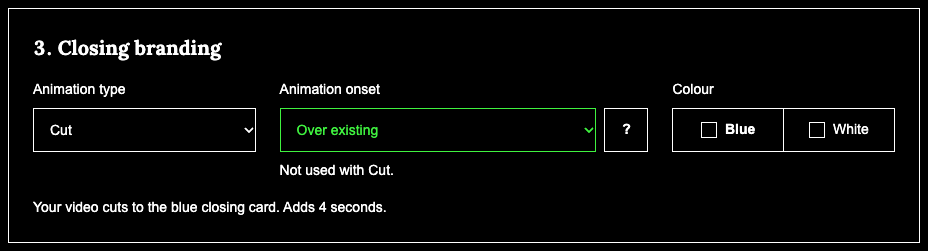

**Standard.** WCAG 1.4.11 Non-text contrast; 1.4.1 Use of colour.

**Experience.** A high-contrast user cannot see the slider at all — the time
fields still work — and cannot tell which closing colour is chosen.

**Direction.** A `forced-colors` block that draws the track, the handles and
the checked segment in system colours (`CanvasText`, `Highlight`).

**Source.** No `forced-colors` rule anywhere in `src/styles/`; the slider is
drawn by backgrounds (`src/styles/app.css:914-1011`), the checked segment by a
fill (`:828`). **From:** walkthrough; emulated, so confirm on Windows (below).
**Item:** VH-112.

### U-12 The colour swatches look like checkboxes — rank 2

**Saw.** Each colour has a small outlined square beside its name. On the chosen,
blue-filled segment the blue swatch disappears into its own fill and reads as an
empty white-outlined box; the White swatch on the light segment reads as a
second one. Disabled, the chosen swatch becomes a filled square — a ticked box.
Beside them, the disabled "Animation onset" select is drawn lighter and brighter
than the live "Animation type" select.

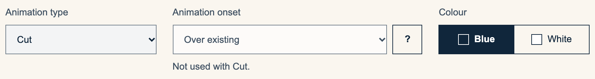

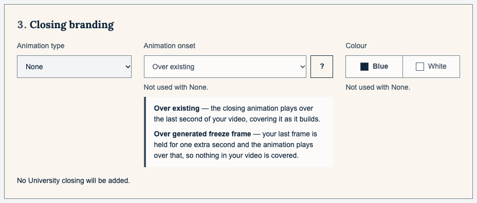

**Standard.** UI-STANDARDS → Consistency, Recognition over recall; Carbon's
selection controls carry no checkbox mark in a single choice.

**Experience.** Two "unticked boxes" for a question with one answer, a choice
whose look flips between states, and a disabled field that looks like the live
one.

**Direction.** A swatch that shows its colour in every state; a disabled field
that reads as disabled at a glance, keeping the AAA text pair the stylesheet
already protects.

**Source.** `index.html:231-250`; `src/styles/app.css:724-743`, `:854-867`.
**From:** walkthrough. **Item:** VH-112.

### U-13 Two primary buttons once the video is ready — rank 2

**Saw.** When the job ends, "Create the video" and "Save the video" are both
solid, one above the other; after "Saved.", Create is still the solid one.

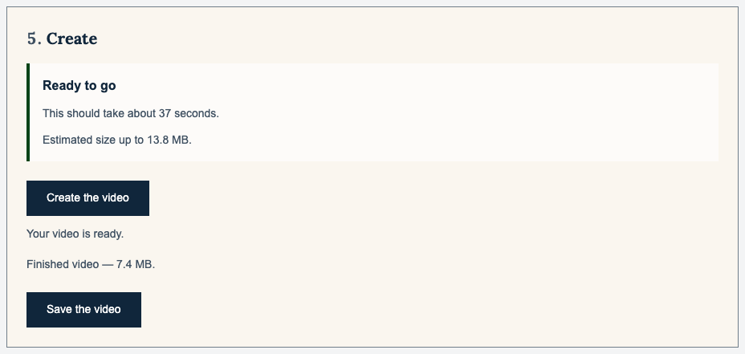

**Standard.** Carbon: one primary button per view; UI-STANDARDS → Minimalist
design ("no competing calls to action").

**Experience.** The first solid button a finishing user meets is the one that
starts again, and it leads to U-02's question.

**Direction.** Once a result exists, Save is the only primary action and Create
steps down.

**Source.** `src/main.ts:1158`, `:1535`. **From:** walkthrough.
**Item:** VH-112.

### U-14 A chosen Fade or Slide can quietly become a cut — rank 2

**Saw (source).** If the animation clip fails to load, the job falls back to a
plain cut, logs a warning and reports success; the result says nothing, and the
line above it still describes the fade. Not reproducible in Chrome with a
network, where the clip loads — this is a failed-fetch or engine path.

**Standard.** UI-STANDARDS → System status; spec §4.3 (the result line states
what the selection will do).

**Experience.** The user publishes a video whose closing is not the one the
page described.

**Direction.** Keep the fallback; say so beside the finished result, as VH-22
already does for a closing that could not be loaded at all.

**Source.** `src/media/pipeline.ts:338-356`, `:738`; `src/main.ts:1509-1518`.
**From:** Codex F03, verified in source. Ranked 2 rather than Codex's 1: a cut
is still University branding, and the path needs a failed fetch or an engine
that cannot decode the clip. **Item:** VH-107.

### U-15 "Saved." can be overwritten by "could not be saved" — rank 2

**Saw (source).** After a successful write the page says "Saved." and asks the
worker to clear the scratch copy; if that request fails or times out, the
shared error path replaces the status with "The video could not be saved. It is
still here to try again." — while the button already reads "Saved" and is
disabled.

**Standard.** UI-STANDARDS → System status; spec §9.2.

**Experience.** Someone told their saved video failed may save it again, or
distrust the file they have.

**Direction.** Separate delivery from clean-up: once the write succeeds, a
clean-up failure is logged, not announced as a failed save.

**Source.** `src/main.ts:1589-1607`. **From:** Codex F04, verified in source.
Ranked 2 rather than 1: it needs a worker failure after a good save.
**Item:** VH-107.

### U-16 The phone warning can miss iPhones and iPads — rank 2

**Saw (source).** The device class is decided in the worker. Where
`navigator.userAgentData` is absent, as in Safari, it falls back to
`matchMedia('(pointer: coarse)')` — which a worker does not have — and returns
"desktop". Spec §10 lets Safari 26 and later run, so an iPhone would get no
"Use a computer if you can" and no acknowledgement. In Chrome's phone emulation
the warning appeared as it should, because `userAgentData.mobile` is set there.

**Standard.** Spec §7.3 and §9.4 (processing discouraged on mobile, with a
clear warning).

**Direction.** Decide the device class on the main thread and pass it in.

**Source.** `src/media/capability.ts:64-71`; `src/workers/job.worker.ts:396`.
**From:** Codex F12, verified in source; needs a real iPhone (below).
**Item:** VH-113.

### U-17 A bad time can silently revert — rank 2

**Saw.** Start time "abc": "Write the start time as minutes and seconds, like
1:05.5." Then a valid end time: the start field silently becomes "0:00.0" and
its error goes.

**Standard.** UI-STANDARDS → Error prevention and recovery.

**Experience.** What the user typed is replaced without a word and Create comes
back, on a start they did not choose; the result line, "Keeping 1 minute 50
seconds of 2 minutes 10 seconds.", is the only clue.

**Direction.** Keep each field's pending text and error until that field is
corrected.

**Source.** `src/main.ts:1018-1023`, `:928-929`. **From:** both — Codex F13,
reproduced live. A first draft ranked it 3; Codex's check of this report argued
it back to 2, because the substitution re-enables the job. **Item:** VH-108.

### U-18 Cancel does not reach the device check or a save in progress — rank 2

**Saw (source).** Cancel exists only while a job runs. The device check
("Checking this video against your device…") and a streaming save have no stop.
Both took seconds here; a save of gigabytes to a slow or synced folder takes
longer.

**Standard.** Spec §9.2 ("Cancel is always available"); UI-STANDARDS → User
control and freedom.

**Direction.** Extend the same Cancel to a long check or save, with clean-up and
a plain closing status.

**Source.** `src/main.ts:729`, `:1229`, `:1255-1269`, `:1459`;
`src/media/save.ts:128`. **From:** Codex F11, verified in source. A first draft
ranked it 3, since every wait here was seconds; Codex's check argued it back to
2 — the tool sets no size limit, and a large save to a slow folder locks every
choice with no way out. **Item:** VH-110.

### U-19 The mobile verdict promises what its body withdraws — rank 3

**Saw.** At phone width, a 2-minute lecture: "This will work, but it will be
slow — Phones and tablets are much slower at this than a computer, and are more
likely to stop part-way. Use a computer if you can. This should take about 40
seconds." The heading promises it will work; the body says it may well not. A
novice also meets "slow" directly above "about 40 seconds" — slow beside a
computer, which the sentence leaves them to infer. The drop zone's dashed box
and "Or drop a video file here." also appear on a touch phone, where files
cannot be dragged.

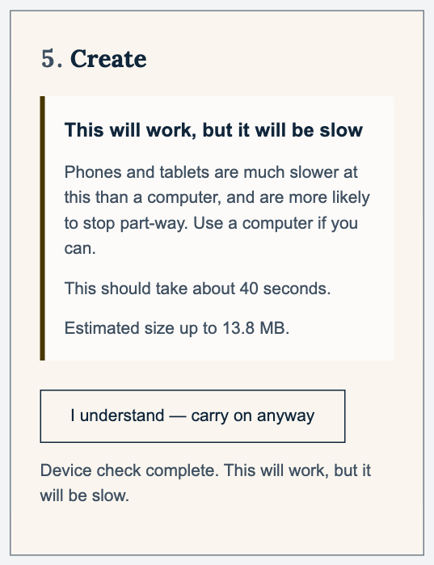

**Standard.** UI-STANDARDS → Consistency, Minimalist design.

**Direction.** Lead the mobile verdict with the real risk — it may stop
part-way — instead of an unconditional "This will work"; hide the drop hint on
a coarse pointer.

**Source.** `src/ui/preflight-panel.ts:20`, `:55`; `index.html:77`.
**From:** walkthrough; reframed after Codex's check, which showed the estimate
does not itself contradict "slow". **Item:** VH-113.

### U-20 The phone time fields cannot type the format they ask for — rank 3

**Saw (source).** Both time fields ask for `inputmode="decimal"` — a phone
keyboard of digits and a decimal point, with no colon — while the helper says
"Minutes and seconds, like 1:05.5." Plain seconds are accepted, but nothing
says so.

**Standard.** WCAG 3.3.2 Labels or instructions; spec §9.4.

**Direction.** Say that plain seconds work, or choose a keyboard with a colon —
after checking real phones.

**Source.** `index.html:125`, `:142`, `:153`; `src/ui/trim.ts:31-45`.
**From:** Codex F16, verified in source; needs a device. **Item:** VH-113.

### U-21 Locked steps do not say why — rank 3

**Saw.** During a job every control that changes the output is disabled — only
Trim's preview player stays usable — and nothing on screen says they are locked
until the video is made, though VH-90's own rule is that a control which cannot
change anything says why, in visible text.

**Direction.** One line where the lock is felt: "Locked while your video is
being made."

**Source.** `src/main.ts:1264-1279`. **From:** walkthrough. **Item:** VH-112.

### U-22 Estimates to the second, and a silent tab — rank 3

**Saw.** "This should take about 5 minutes 20 seconds." An earlier load of the
same file said "about 6 minutes 42 seconds", and the job ran about three
minutes before failing; AMCS3059, estimated at 37 to 45 seconds across loads,
took 24. Throughout a job the tab title stays "UoN Video Helper", so someone who
switches to their email cannot see progress or that it is done.

**Standard.** UI-STANDARDS → System status; plain language.

**Direction.** Round the estimate ("about 5 minutes"); put the stage, or
"ready", in the tab title.

**Source.** `src/ui/format.ts:13-35`; `src/ui/preflight-panel.ts:117-121`;
`index.html:6`. **From:** walkthrough. **Item:** VH-109.

### U-23 Words a novice does not use — rank 3

**Saw.** "The loudest and quietest parts differ by about 21.9 LU." "It measures
about … LUFS, well below a comfortable listening level." "Branding will still be
added and the video re-encoded". One outcome under four names: "consistent
audio levels" in the opening lines, "Levelling" in the source panel, "evened
out" in the sound notes, "sound levelling" in the verdict. And the opening
list's "outputs an optimised file type and size" says little.

**Standard.** UI-STANDARDS → user language, not implementation terms; the same
words for the same concepts; spec §9.2.

**Direction.** Drop the units — the sentences around them already say what
matters; say nothing about re-encoding; choose one name for levelling.

**Source.** `src/ui/warning-text.ts:34`, `:47`, `:53`;
`src/ui/source-panel.ts:180`; `src/ui/preflight-panel.ts:141`;
`index.html:41-43`. **From:** both — Codex's copy audit, seen live.
**Item:** VH-114.

### U-24 Claims the job does not make — rank 3

**Saw.** The save dialog suggested "AMCS3059 - Module in a Minute (002)
(branded).mp4", and in source it builds the same "(branded)" name whatever was
chosen, None included. "Your video is already compressed as far as this setting
would take it, so it will come out about the same size. The branding and sound
levelling are still applied." is said whenever the bitrate is capped to the
source's — however much was trimmed away, and whatever the closing. "This video
has no sound — Branding will still be added…" is said regardless of None.
"Ready, with one thing to know" heads a verdict that can list several.

**Standard.** UI-STANDARDS → Consistency, System status.

**Direction.** Make each claim depend on the job — no "(branded)" without a
closing, no "about the same size" after a trim, no "branding … still applied"
under None — or drop it.

**Source.** `src/media/save.ts:166`; `src/ui/preflight-panel.ts:19`,
`:136-141`; `src/ui/warning-text.ts:34`. **From:** both — Codex F14; the save
name seen live. **Item:** VH-114.

### U-25 Said twice, then nothing — rank 3

**Saw.** Under the "Ready to go" box the status line shows "Device check
complete. Ready to go." — it is the live region, and has to say it, but it need
not show it. After "Saved." nothing says what next: how to make another (choose
a new video in step 1), or that the file is now the user's to upload.

**Direction.** Show only what the box does not, while still announcing it;
after Saved, one sentence on what next.

**Source.** `src/ui/preflight-panel.ts:204`; `src/main.ts:1589-1600`.
**From:** walkthrough. **Item:** VH-114.

## What held up

- An unreadable file says what happened and what to do: "This file could not be
  read as a video. It needs to be an MP4, MOV, MKV or WebM file, and it may be
  corrupted. Your original file has not been changed. You can choose a
  different one."
- A dropped non-video is refused in words, in place: "That is not a video file.
  Drop a video, such as an MP4 or MOV, or choose one above."
- The caption warning appears before anything is made, in plain words.
- Trim's errors are specific and beside the fields ("The end must come after the
  start.", "Keep at least 3 seconds of the video."), and "Use the whole video"
  puts it back.
- The closing's result line says in words what each combination will do, which
  is what stops "None" reading as "no animation".
- In Chrome's phone emulation, processing is discouraged and needs "I
  understand — carry on anyway", as spec §7.3 and §9.4 ask (U-16 is the path
  where it is not).
- The trim handles are drawn 24 px across but each is a 44 × 44 px target: the
  painted circle sits inside a transparent thumb of the full size.
- During a job every choice is locked, and leaving with an unsaved video raises
  the browser's leave warning.
- Cancel says "Cancelled. Nothing was saved, and your original file is
  unchanged."
- The keyboard order follows the steps; a focus ring is visible on every control
  tried, the trim handles and colour segments included; the "?" is a toggletip
  opened by click or key, not a hover tooltip.
- No horizontal scroll at 390 or at 320 px; WCAG text spacing clips nothing;
  dark mode is coherent.

## Set aside, with reasons

- **Video properties' technical rows** ("Video codec", "Container", "Audio
  sample rate") — behind a closed disclosure, read-only, and there for the
  maintainer; not on a novice's path.
- **"Animation onset", "Over existing", "Over generated freeze frame", and Cut
  beside None** — the maintainer's VH-90 wording, named in spec §4.3, and the
  result line already says what each does. Whether staff understand them is a
  question for the pilot session below, not one a review can settle.
- **"Larger / better" and "Smaller / reduced"** — the maintainer's VH-85 names;
  likewise a pilot question.
- **The browser's own video controls** — WCAG 2.5.5 exempts unmodified
  user-agent controls.
- **The "target missed" sound note** — Codex found no production caller; the
  worker refuses such a file instead (U-01), so it is not a state the page
  reaches.
- **An iPhone HDR clip reads "Ready to go" with no colour caveat** — VH-26
  measured the browser's own tone-mapping of the genuinely HDR samples to within
  two levels; not a page defect.

## VH-97: should finished stages fold?

The page is long — about 2,765 px at desktop once a file is read, three screens
at 900 px, and about 3,000 px at phone width — and during a job steps 2–4 sit,
locked, between the user and the progress. But nothing in the walk suggests
people lose their place because of length: the order is linear, each heading
says what its step is, and the job's status sits beside its button. What went
wrong went wrong in time — verdicts, questions, results and focus that outlive
the moment they described (U-02 to U-04, U-09). Folding would hide those
contradictions rather than fix them, and would add transitions of its own, each
needing focus handed on and announced, which the page does not yet do reliably
at the three it has.

**Recommendation: keep VH-97's default — not built.** Fix VH-107, VH-108 and
VH-111 first; then, if pilot sessions show people hunting for Create or Save,
fold only the setup steps after Create, under the safeguards the ticket already
sets. Codex reached the same view independently, from source.

## What only a person can judge

For the maintainer to arrange. None of it is claimed here.

1. **A pilot session** — three to five staff, each with their own recording,
   unaided, Choose to Save, thinking aloud. Watch for: finding Create and Save;
   whether Cut and None, and Larger and Smaller, mean to them what they mean;
   what they expect Trim's preview to do; whether the sound notes read as
   refusals; whether they know where the file went and what comes next.
2. **Screen readers** — VoiceOver with Safari and with Chrome, NVDA with
   Chrome: announcement order and frequency (U-08, U-10), focus after Create,
   Cancel and finish (U-09), the native player, the two slider handles.
3. **Real phones** — Chrome on Android, Safari 26 on iPhone: the warning
   (U-16), the time-field keyboards (U-20), the drop zone, and reading five
   steps at that width.
4. **Speech input** — Voice Control or Dragon: "click Create the video", "click
   Set start here", the "?" button.
5. **Windows high contrast** — U-11 on a real Windows machine rather than an
   emulation.
6. **A managed University Windows laptop** — the save dialog into a
   OneDrive-synced folder, the email route for feedback, the screen staying
   awake through a long job.

## Disposition

| Finding | Rank | Disposition |
| --- | --- | --- |
| U-01 | 1 | VH-106 |
| U-02, U-03 | 1 | VH-107 |
| U-14, U-15 | 2 | VH-107 |
| U-04, U-05, U-17 | 2 | VH-108 |
| U-07, U-08 | 2 | VH-109 |
| U-22 | 3 | VH-109 |
| U-06, U-18 | 2 | VH-110 |
| U-09, U-10 | 2 | VH-111 |
| U-11, U-12, U-13 | 2 | VH-112 |
| U-21 | 3 | VH-112 |
| U-16 | 2 | VH-113 |
| U-19, U-20 | 3 | VH-113 |
| U-23, U-24, U-25 | 3 | VH-114 |

Codex's sixteen, by number: F01 → U-02, F02 → U-03, F03 → U-14, F04 → U-15,
F05 → U-10, F06–F08 → U-06, F09 → U-04, F10 → U-07, F11 → U-18, F12 → U-16,
F13 → U-17, F14 → U-24, F15 → U-09, F16 → U-20.
